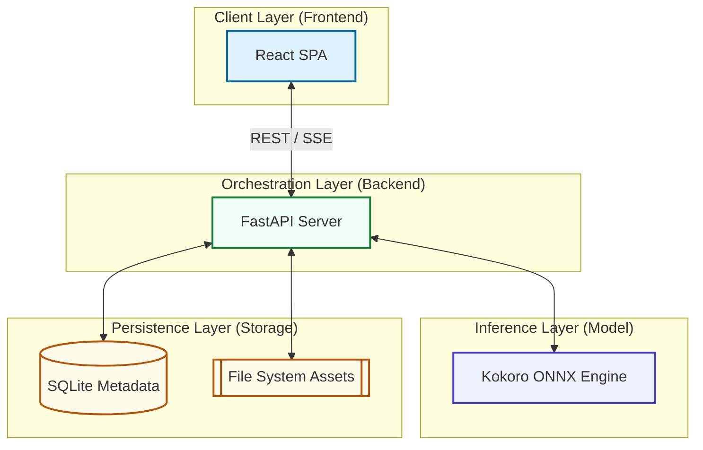
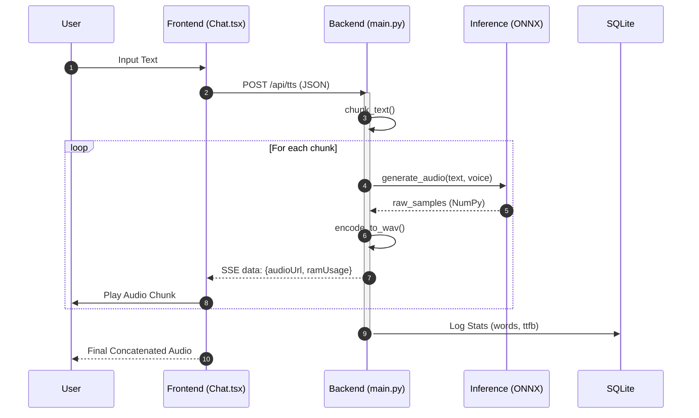
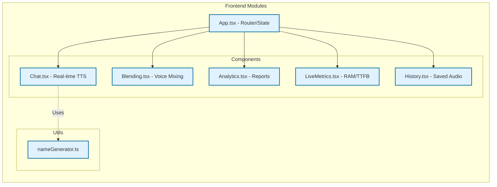
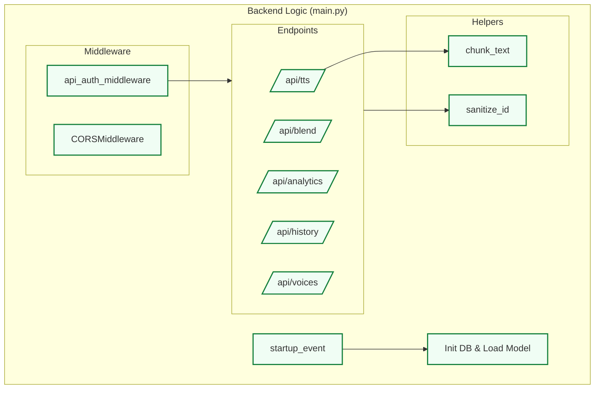
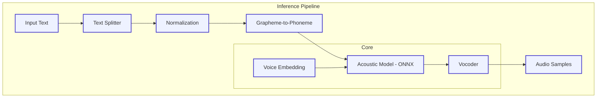
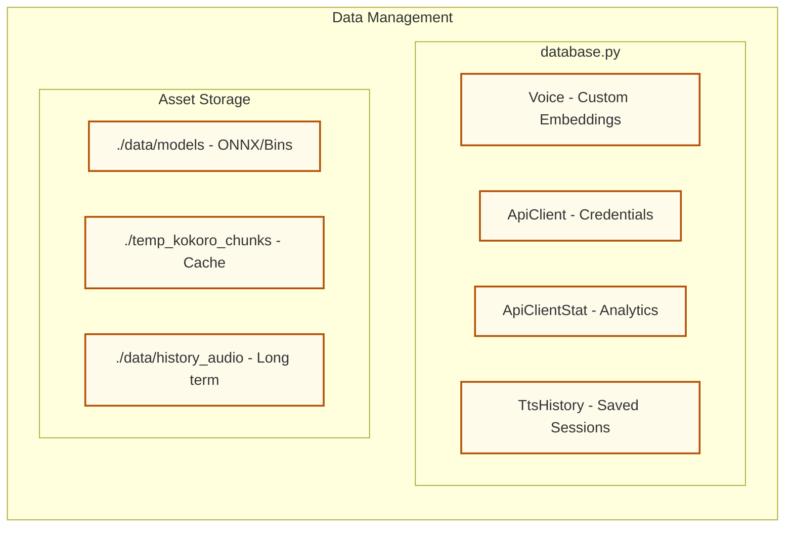

# Kokoro TTS Architecture Explorer

This document provides a highly explainable, hierarchical visualization of the Kokoro TTS codebase, following the structural layout and drilling style of modern architectural explorers like [understand-anything.com](https://understand-anything.com).

---

## 🗺️ System Overview (Level 1)

The system is a self-contained, local Text-to-Speech application. It avoids external API calls by running inference directly on the host machine (optimized for CPU/Jetson).

---

## 🔄 Primary Data Flow: Request to Speech

This flow illustrates how a single text prompt traverses the system to become an audible stream.

---

## 🔍 Module Deep Dive (Level 2 & 3)

Click on a subsystem header below to "drill down" into its internal logic and data flow.

<b>🔵 Subsystem: Frontend (React & Vite)</b>

The frontend is a React-based SPA that manages user interactions, audio playback queues, and real-time metric visualization.

**Component Breakdown:**
*   **App.tsx:** The root orchestrator. It manages the global routing using `react-router` and lifts state for `messages` and `sessionId` so history is preserved when switching tabs.
*   **Chat.tsx:** The primary interaction hub. It handles user input, initiates the SSE connection to `/api/tts`, and manages a complex audio playback queue to ensure seamless streaming.
*   **Blending.tsx:** The admin's creative studio. It provides the UI for selecting two base voices and a sliding ratio to generate new, unique voice embeddings via the `/api/blend` endpoint.
*   **LiveMetrics.tsx:** The performance profiler. It subscribes to the message state and renders high-fidelity Recharts (Bars/Lines) showing RAM consumption and TTFB for every generated chunk.
*   **Analytics.tsx:** The business intelligence view. It aggregates historical data from the backend to show which API clients are most active and their average performance metrics.
*   **History.tsx:** The conversion archive. It allows users to browse and replay the last 50 saved TTS generations, stored locally as `.wav` files.

<b>🟢 Subsystem: Backend (FastAPI)</b>

The backend acts as the central orchestrator, handling authentication, data persistence, and model lifecycle.

**Component Breakdown:**
*   **TTS Endpoint (`/api/tts`):** A POST endpoint that returns a `StreamingResponse`. It coordinates text chunking, model inference, and metadata logging in real-time.
*   **Blend Endpoint (`/api/blend`):** An administrative tool that calculates a new voice embedding vector by interpolating between two existing ones and persists the metadata to SQLite.
*   **Auth Middleware:** A security layer that validates custom headers (`x-client-id`) against the database when the system is deployed in headless/API-only mode.
*   **Helper: `chunk_text`:** A critical performance utility. It splits input text into small bursts to ensure the first audio chunk is delivered to the user as fast as possible (minimizing TTFB).
*   **Startup Logic:** Handles environment discovery, database migration, and pre-loading the heavy ONNX models into memory to avoid latency on the first request.

<b>🟣 Subsystem: Inference Engine (Kokoro ONNX)</b>

The intelligence core responsible for turning text into human-like speech.

**Component Breakdown:**
*   **Text Splitter:** Normalizes raw text (handles numbers, punctuation) and prepares it for phonemization.
*   **G2P (Grapheme-to-Phoneme):** Converts written characters into phonemes (the sounds of speech), ensuring accurate pronunciation of complex words.
*   **Acoustic Model (ONNX):** The "brain" of the system. A neural network that maps phonemes and voice embeddings into a latent representation of sound.
*   **Vocoder:** Transforms the model's latent output into a raw audio waveform that humans can hear.
*   **Voice Embeddings:** Pre-computed 512-dimensional vectors that define the unique characteristics (pitch, tone, accent) of a specific speaker.

<b>🟠 Subsystem: Persistence (SQLite & Files)</b>

Manages the long-term memory and asset storage of the application.

**Component Breakdown:**
*   **Voice Table:** Stores the metadata and blending ratios for custom-created speakers.
*   **ApiClient Table:** Manages the registry of external applications authorized to use the TTS engine.
*   **ApiClientStat Table:** A time-series log of every generation, tracking word counts and latency for performance monitoring.
*   **Asset Storage:** A structured directory tree where the static ONNX models live alongside temporary and permanent `.wav` audio artifacts.

