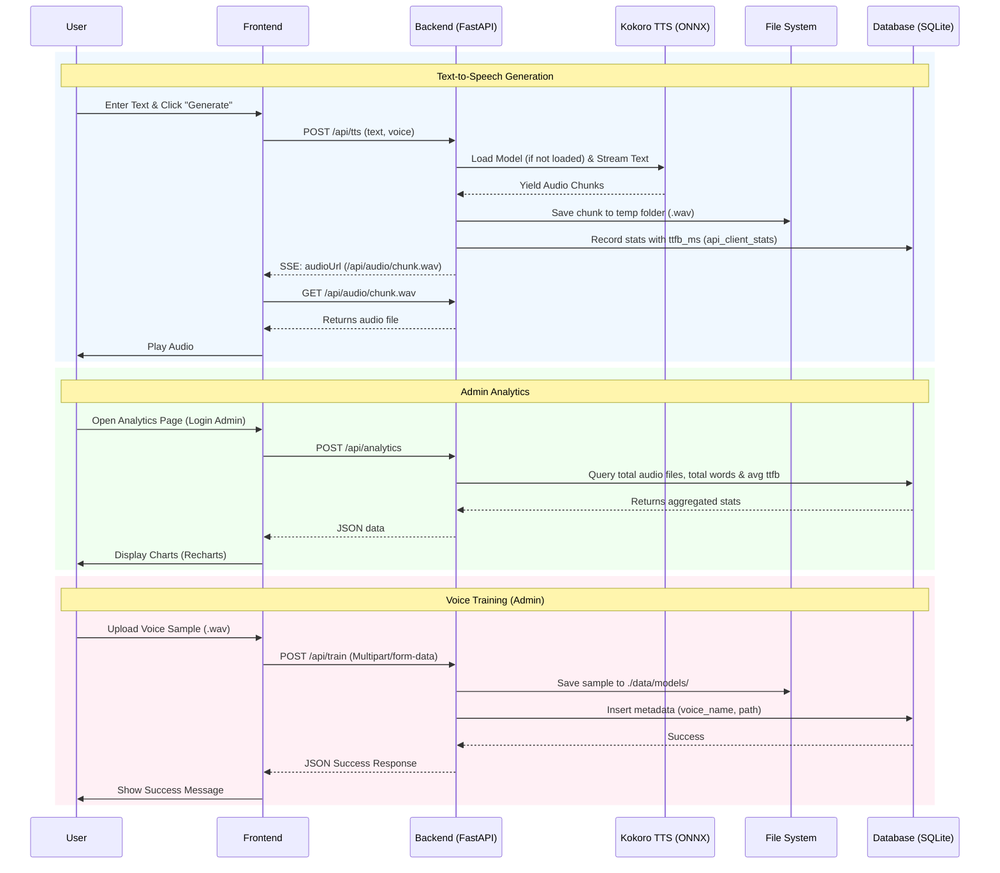

# Kokoro TTS Architecture

This document provides a detailed overview of the application architecture, explaining its components, interactions, and the internals of Kokoro TTS.

## High-Level Architecture

The application is built using a modern architecture, featuring a React frontend and a Python FastAPI backend, and leverages `kokoro-onnx` to perform local, in-memory Text-to-Speech (TTS) generation using an ONNX model. The backend also supports an admin feature to simulate voice model training and save custom voice recordings with SQLite as a metadata store.

### Components

1. **Frontend (React)**:
   - A single-page application powered by React and Vite. It provides the user interface for text input, audio playback, and admin settings (e.g., voice training).
   - Uses Server-Sent Events (SSE) to receive live chunks of audio processing status and URLs from the server.
2. **Backend (FastAPI)**:
   - A Python web server handling the API endpoints (`/api/tts`, `/api/train`, `/api/voices`).
3. **Kokoro TTS Model (`kokoro-onnx`)**:
   - The core text-to-speech engine running entirely inside the Python process using ONNX runtime. It avoids external API calls for voice generation.
4. **Persistent Storage (File System)**:
   - Voice models (uploaded custom voice samples and large ONNX models) are saved to a dedicated local directory (`./data/models`).
   - Temporary audio chunks generated by TTS are saved to a temp directory (`./temp_kokoro_chunks`) and served to the frontend.
5. **Database (SQLite)**:
   - Maintains metadata for trained voices, API clients, and stats in a lightweight local `.db` file (managed via SQLAlchemy and `aiosqlite`).

## Interaction Flow

## How Kokoro TTS Internals Work

Kokoro TTS is an efficient text-to-speech model. The specific version used here is `onnx-community/Kokoro-82M-v1.0-ONNX`, which is optimized to run on CPUs. The internal pipeline for converting text to audio involves several stages:

1. **Text Splitting & Normalization**:
   - The input string is passed through a `TextSplitterStream`. This component normalizes the text (handling punctuation, numbers, and capitalization) and breaks long texts into smaller, manageable chunks or sentences.

2. **Grapheme-to-Phoneme (G2P) Conversion**:
   - The text chunks are converted from graphemes (written characters) into phonemes (distinct units of sound). This is critical for accurate pronunciation, particularly in languages like English with irregular spelling.

3. **Style/Voice Embeddings**:
   - Kokoro uses pre-computed voice embeddings (e.g., `af_heart`) which dictate the pitch, tone, and accent of the generated speech. These embeddings condition the acoustic model.

4. **Acoustic Model (ONNX)**:
   - The core neural network, running via ONNX Runtime in CPU mode, takes the phoneme sequence and the selected voice embedding as inputs.
   - It outputs a Mel-spectrogram, representing the acoustic properties of the speech over time.

5. **Vocoder**:
   - A vocoder processes the Mel-spectrogram and synthesizes the final raw audio waveform.
   - The `kokoro-onnx` library handles the streaming output of this audio, allowing the FastAPI server to pipe `.wav` chunks directly to the user before the entire sentence has finished generating.
