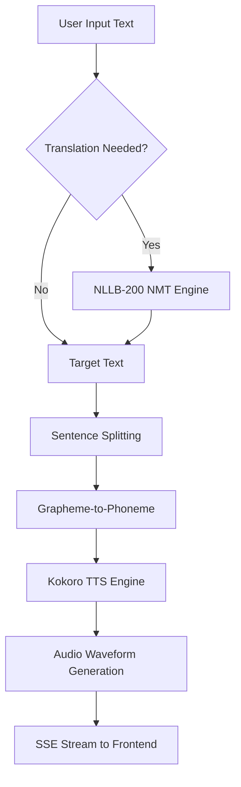
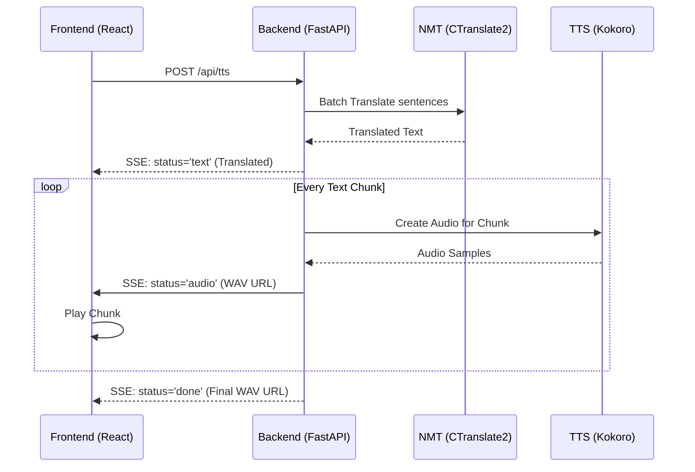

# Detailed Architecture from First Principles

This document breaks down the system's architecture from first principles, focusing on the data flow, model execution, and the integration between Neural Machine Translation (NMT) and Text-to-Speech (TTS).

## 1. Core Design Philosophy

The system is designed as a **decoupled, local-first streaming pipeline**.

*   **Decoupled**: Frontend and Backend communicate via standard APIs and SSE, allowing for independent scaling or replacement of components.
*   **Local-first**: All model execution (NMT and TTS) happens on-device (CPU), eliminating latency and privacy concerns associated with cloud providers.
*   **Streaming**: Audio is delivered to the user as it is generated, minimizing Time to First Byte (TTFB).

## 2. The Integrated Pipeline

The most complex part of the system is the transition from raw text in one language to spoken audio in another.

### 2.1 Neural Machine Translation (NMT)
The translation stage uses **NLLB-200** (No Language Left Behind) quantized to **INT8** and executed via **CTranslate2**.

*   **Principles of Optimization**:
    *   **Sentence Splitting**: Large blocks of text are split into sentences.
    *   **Batch Processing**: Sentences are processed in parallel (`translate_batch`) to maximize CPU utilization.
    *   **Thread Tuning**: The engine is tuned to use physical CPU cores (`intra_threads`), avoiding the overhead of hyperthreading context switches.

### 2.2 Text-to-Speech (TTS)
The synthesis stage uses **Kokoro v1.0** via **ONNX Runtime**.

1.  **Phonemization**: Converting characters into sounds.
2.  **Style Embedding**: Applying a voice "identity" (e.g., pitch, cadence).
3.  **Acoustic Modeling**: Mapping phonemes to acoustic features.
4.  **Vocoding**: Transforming acoustic features into a playable waveform.

## 3. Communication Architecture (SSE)

To provide a responsive UI, the system uses **Server-Sent Events (SSE)**. Unlike traditional REST, SSE allows the server to push updates (text chunks, audio URLs, RAM metrics) to the client.

## 4. Data Layer and Persistence

The system maintains a local SQLite database for metadata and a file-system-based cache for audio.

*   **Metadata (SQLite)**: Tracks API clients, usage statistics (words processed, TTFB), and blended voice definitions.
*   **Audio Cache**:
    *   `temp_kokoro_chunks/`: Ephemeral WAV files for individual message chunks (deleted after 60s).
    *   `session_audio/`: Concatenated WAV files for current session history.
    *   `history_audio/`: Manually saved audio files.

## 5. Security Principles

1.  **Input Sanitization**: All IDs and paths are sanitized to prevent Path Traversal.
2.  **Stateless Request Auth**: `API_ONLY` mode uses Header-based auth (`x-client-id`, `x-client-secret`).
3.  **Resource Limiting**: TTS generation tracks RAM usage and TTFB to prevent resource exhaustion and provide visibility into system health.
