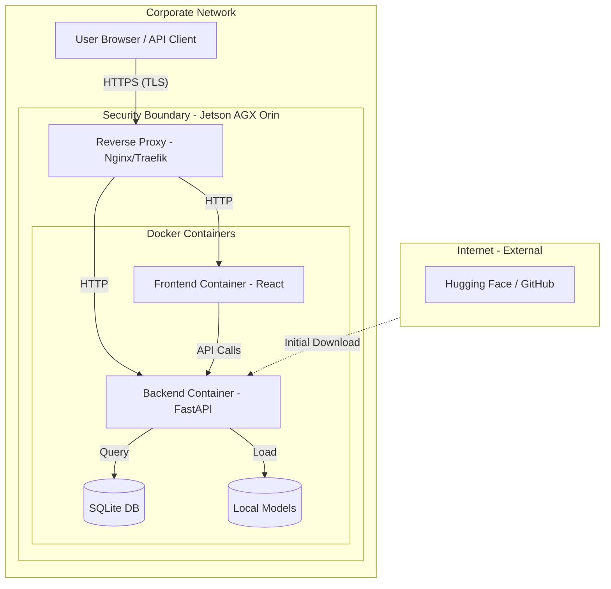

# Security and Vulnerability Report

This document provides a comprehensive security review of the Kokoro TTS codebase, specifically tailored for deployment on a **NVIDIA Jetson AGX Orin 64GB** within a **corporate network** environment.

## 1. System Architecture & Security Boundaries

The following diagram illustrates the recommended secure deployment architecture. It introduces a Reverse Proxy (e.g., Nginx) to handle TLS termination and network isolation, which are not natively implemented in the FastAPI backend.



---

## 2. Security Audit Findings

The following vulnerabilities were identified during the codebase review. These should be addressed before deploying to a production or corporate environment.

### 2.1 Critical: Hardcoded Administrative Credentials
- **Issue**: The administrative password (`kP9$vW2!mX7#qZ4`) is hardcoded in both `backend/main.py` and `frontend/src/components/Blending.tsx`.
- **Risk**: Any user with access to the frontend source or backend binary can easily obtain administrative control, allowing them to create API clients and view analytics.
- **Recommendation**: Replace hardcoded values with environment variables (`ADMIN_PASSWORD`). Use a secure password hashing mechanism (like `bcrypt`) if storing passwords in the database.

### 2.2 High: Wildcard CORS Configuration
- **Issue**: The backend is configured with `allow_origins=["*"]`.
- **Risk**: This allows any website to make requests to the backend API if the user's browser has network access to the Jetson device. This facilitates Cross-Site Request Forgery (CSRF) and data exfiltration.
- **Recommendation**: Restrict `allow_origins` to the specific internal corporate domain or the IP address of the frontend service.

### 2.3 Medium: Potential Path Traversal in Audio Endpoints
- **Issue**: Endpoints like `/api/audio/{filename}` and `/api/history/audio/{filename}` use `os.path.join` with user-supplied filenames. While some basic sanitization exists, it is not robust against advanced traversal techniques.
- **Risk**: An attacker could potentially read arbitrary files from the Jetson file system that the Docker user has access to.
- **Recommendation**: Use a strict whitelist for filenames or utilize FastAPI's `FileResponse` with pre-validated paths. Ensure the application runs as a non-root user.

### 2.4 Medium: Lack of Encryption and Rate Limiting
- **Issue**: The application communicates over plain HTTP. There is no built-in rate limiting on the TTS or translation endpoints.
- **Risk**:
    - Credentials and audio data can be intercepted on the corporate network.
    - An internal user or automated script could overwhelm the Jetson's CPU/GPU by sending massive amounts of text for synthesis (Denial of Service).
- **Recommendation**: Deploy behind a reverse proxy for HTTPS. Implement rate limiting (e.g., using `slowapi` for FastAPI or Nginx's `limit_req`).

---

## 3. Jetson AGX Orin Deployment Guide

### 3.1 ARM64 & GPU Optimization
To leverage the Orin's 64GB RAM and Ampere GPU:

1.  **Base Image**: Instead of `python:3.11-slim`, use NVIDIA's L4T (Linux for Tegra) base images:
    ```dockerfile
    FROM nvcr.io/nvidia/l4t-ml:r35.2.1-py3
    ```
2.  **GPU Inference**: Install `onnxruntime-gpu`. Update the backend initialization to use the `CUDAExecutionProvider`:
    ```python
    # Example change in backend/main.py
    kokoro_model = Kokoro(model_path, voices_path, providers=['CUDAExecutionProvider'])
    ```
3.  **Memory Management**: Since the GPU and CPU share the 64GB RAM on Orin, monitor the Unified Memory usage. The current `psutil` implementation in the code is helpful but should be supplemented with `nvidia-smi` or `tegrastats`.

### 3.2 Corporate Network Hardening

1.  **Air-Gapped / Restricted Setup**:
    - Corporate networks often block Hugging Face or GitHub. Pre-download the models during the build phase or use an internal Artifactory/Proxy.
    - Set `HTTP_PROXY` and `HTTPS_PROXY` in the Dockerfile if a proxy is required for the initial setup.
2.  **Secrets Management**:
    - Use Docker Secrets or a `.env` file that is **not** committed to version control.
    - Ensure `HF_TOKEN` is handled securely as a build-time secret.
3.  **Network Isolation**:
    - Place the Jetson in a dedicated VLAN.
    - Use a firewall to restrict access to ports 3000 (Frontend) and 8000 (Backend) to authorized subnets only.

### 3.3 Hardening Checklist
- [ ] Move `ADMIN_PASSWORD` to environment variables.
- [ ] Change `allow_origins` from `*` to specific corporate domains.
- [ ] Implement HTTPS via Nginx.
- [ ] Configure Docker to use the `nvidia` runtime (`--runtime nvidia`).
- [ ] Run the container as a non-privileged user.
- [ ] Set up log rotation for the temporary audio chunk directory.
